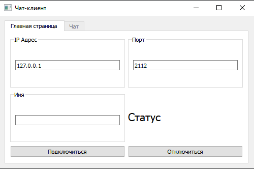
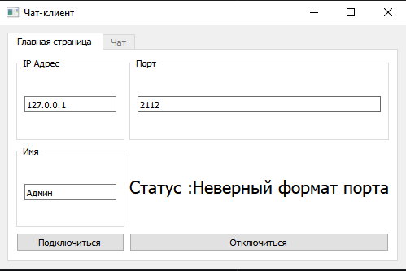
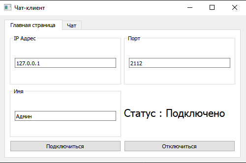
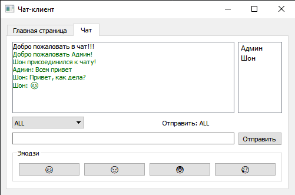
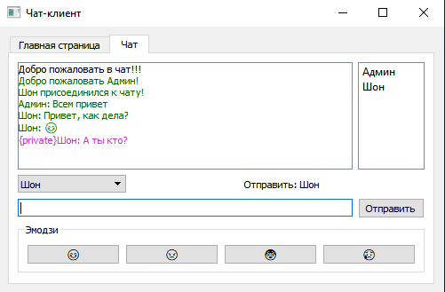
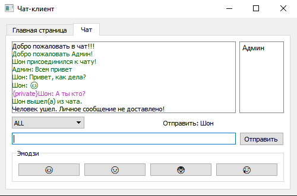
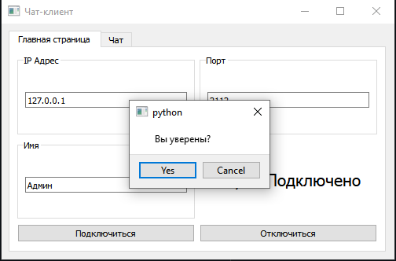

# Пользовательский интерфейс клиента для сервера чата

## Информационный проект
Реализовать пользовательский интерфейс для сервера чата. Этот графический интерфейс имеет строку ввода IP, порта и имени и может транслировать, приватно отправлять, получать и отображать сообщения в соответствии с серверным протоколом строкового формата.
## Требования к окружающей среде
- Python > 3.6
- PyQt5
### Запустить сервер
```
python server.py --host 127.0.0.1 --port 33002
```
### Запустить пользовательский интерфейс клиента
```
python client.py
```
## Функции
### Общий дизайн
- вкладки для отдельных функций: Главная страница или чат
- вкладка чата отключена до настройки подключения
- окно сообщений для подтверждения выхода и отключения перед выходом
### Главная страница
- неограниченное переделывание соединения
- недопустимый порт или недопустимый IP-адрес, установлен по умолчанию IP 127.0.0.1 порт 2112
- не беспокойтесь об отказе в соединении, с этим справится код исключения
### Вкладка «Чат»
- отправка сообщения либо нажатием кнопки GUI, либо нажатием клавиши ввода с клавиатуры
- очистить виджет LineEdit после отправки каждого сообщения
- отображение полученных сообщений в режиме реального времени
- столбец сообщений всегда прокручивается вниз до самого нового сообщения
- отображение личных сообщений как на отправителе, так и на получателе, с цветом
- обновление в режиме реального времени выпадающего списка и списка посещаемости при приеме трансляции сервера
- как только получатель уйдет до отправки личного сообщения, отобразится «Личное сообщение не доставлено»
- Пространство для расширения окна предпочтительно для столбца сообщений
- EMOJI, это то, о чем просит чат
## Скриншоты
 
 





